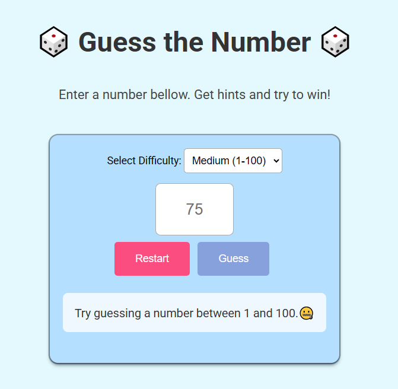

# Guess the Number Game

> A simple number guessing game with three difficulty levels.

## Table of contents

- [Guess the Number Game](#guess-the-number-game)
  - [Table of contents](#table-of-contents)
  - [General info](#general-info)
  - [Screenshots](#screenshots)
  - [Technologies](#technologies)
  - [Setup](#setup)
  - [Code Examples](#code-examples)
  - [Features](#features)
  - [Status](#status)
  - [Inspiration](#inspiration)
  - [Contact](#contact)

## General info

> This is a simple number guessing game where players select a difficulty level and try to guess the hidden number.

## Screenshots



## Technologies

- HTML
- CSS
- JavaScript
- VS code

## Setup

- Clone the repository
- `npm install`

## Code Examples

```js
const randomNumber = (range = 50) => {
  return Math.floor(Math.random() * range) + 1;
};
```

## Features

- Choose difficulty level
- Input guesses and get feedback

## Status

Project is: _Done_

## Inspiration

Project inspired by beginner JavaScript learning challenges.

## Contact

By:

- [Sajid Hussain](https://github.com/SajidHussainabbasi)
- [Daniiel Mykytiuk](https://github.com/danmkt00)
- [Harley Clair](https://github.com/harley-dane)
- [Catherine Lin](https://github.com/boba-milktea)
